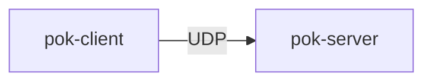
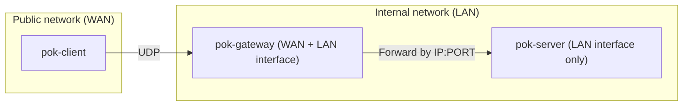
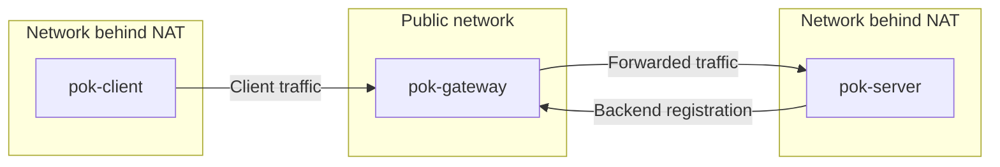

# INTRODUCTION

`POK` provides an encrypted and authenticated client–server communication layer
built on top of UDP.

`POK` is an acronym for **Postquantum OverKill**, emphasizing a conservative
cryptographic design with large security margins.

Encryption and authentication are provided by:

- [Classic McEliece mceliece6688128](https://lib.mceliece.org)
- XSalsa20/[Poly1305](https://lib1305.cr.yp.to)

This combination provides sufficient resistance to both classical and quantum
attacks.

---

# Connection

The connection setup consists of several phases that together establish
an authenticated and encrypted session.
Packet formats and detailed phase descriptions are specified in
[`protocol.md`](protocol.md).

## 1. Public-key download (L)

Before a client can establish a secure connection, it must obtain and verify
the server’s long-term public key.

The server uses the McEliece mceliece6688128 variant, which has a ~1 MB public
key. To make distribution practical:

- The public key is split into small packet-sized blocks.
- These blocks are transferred using separate packets.
- The public key is distributed as a Merkle tree, which allows efficient
  verification of individual blocks.
- The Merkle root hash is stored in DNS.

Inspiration taken from [Pqconnect](https://www.pqconnect.net/).

## 2. Key exchange (K)

After obtaining the server’s long-term public key, the client performs
a key exchange to derive one-time session encryption keys.

During this phase, two McEliece mceliece6688128 public keys are transmitted
from the client to the server:

- An ephemeral (one-time) public key, providing forward secrecy.
- An authentication public key, used to authenticate the client
  within the session.

Each public key is approximately 1 MB in size. The keys are transmitted
using an [mctiny](https://mctiny.org)-like protocol, which splits them into
packet-sized blocks and allows stateless processing on the server side.

## 3. Initialization (I)

After the key exchange phase both parties derive their session keys and initialize
the encrypted transport state. The message processing handler
is then started to handle incoming encrypted messages.

## 4. Messages (M)

Once initialization completes, encrypted communication begins.
Application data is transmitted using encrypted and authenticated packets.

In addition to message transport (M), the protocol defines ping/keepalive
packets (P) used to maintain sessions and backend registrations.

---

# Connection modes
The tool works in the classic `client-server` mode, but also aims
to be used in the `client-gateway-server` mode. This can be useful when the
network structure is more complex (e.g. a server behind NAT).

## Simple (direct) — client → server

`pok-client` creates a direct connection to `pok-server`.



## Advanced (forwarded) — client → gateway → server
  
`pok-gateway` is a UDP forwarding component that routes incoming packets from
`pok-client` to the appropriate backend `pok-server` based on metadata stored
in the packet's 32-byte `extension` field (see [protocol.md](protocol.md)).

The gateway:

- inspects the `extension` field
- makes routing decisions based on that field
- forwards packets to backend servers
- supports:
  - IP[:PORT]-based routing
  - serverID-based routing (server public-key hash)

---

### 1. Forwarding by IP[:PORT]

In this mode, the extension field directly contains the target backend address.

1. The gateway extracts `IP[:PORT]` from the extension.
2. It forwards the UDP packet to that address.
3. The backend server receives and decrypts the query packet.
4. The backend server encrypts and sends the response packet.
5. The gateway forwards the packet back to the client.



---

### 2. Forwarding by serverID (server public-key hash)

In this mode, the extension contains the 32-byte server public-key hash
(serverID) identifying the backend server.

#### Backend Registration

- Each backend server establishes a backend session to the gateway and maintains
  it with keepalives.
- The backend authenticates using its long-term key identity; the serverID is
  the public-key hash.
- The gateway associates that serverID with the server endpoint (IP:PORT)
  observed during registration and keepalives.

#### Client Packet Handling

1. The client sends a packet.
2. The extension contains the 32-byte serverID.
3. The gateway looks up the registered server endpoint for that serverID.
4. The packet is forwarded to that endpoint.



---

## Build and run tests

This project requires development headers for Classic McEliece and randombytes.
For example on Debian/Ubuntu:

`apt-get install libmceliece-dev librandombytes-dev`

Build and run tests:

```sh
make
make test
```

---

# Examples
- [client-server example](examples/client-server.md)
- [IP:PORT based client-gateway-server example](examples/ipportbased-client-gateway-server.md)
- [Public-key based client-gateway-server example](examples/pkbased-client-gateway-server.md)
