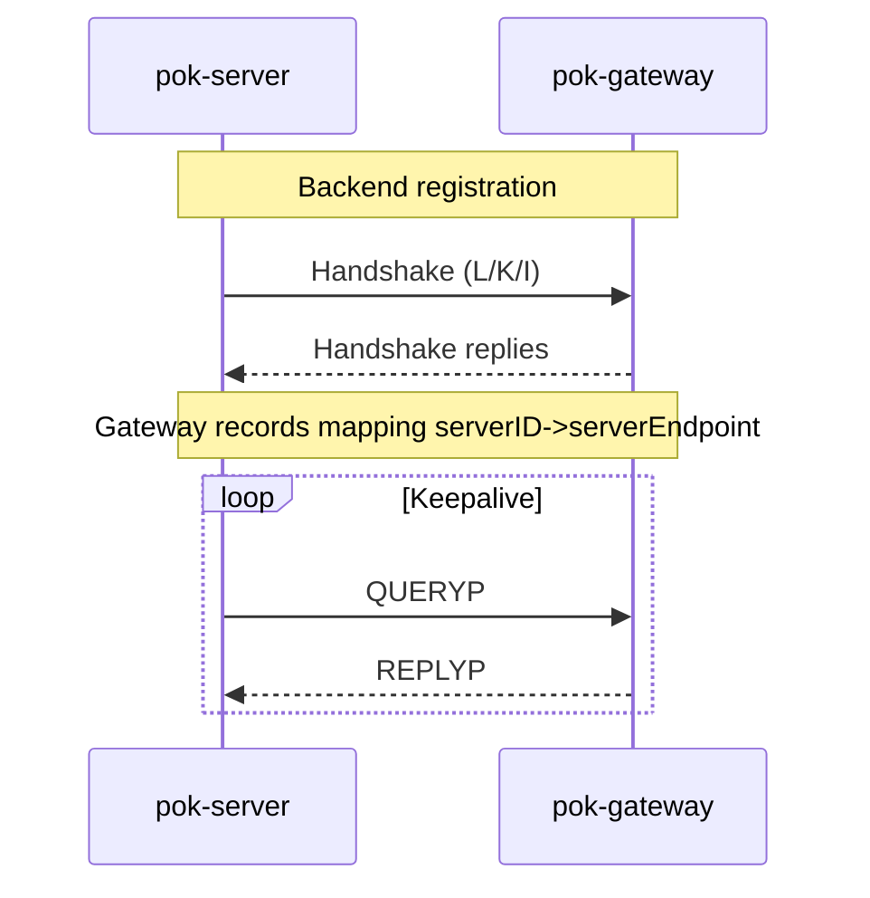
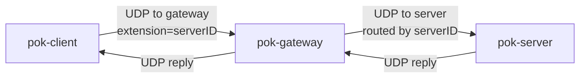
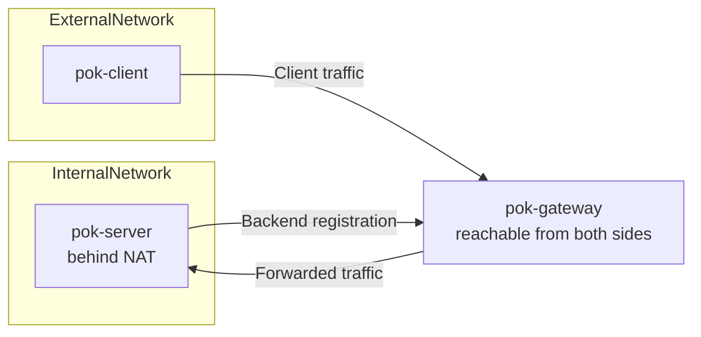
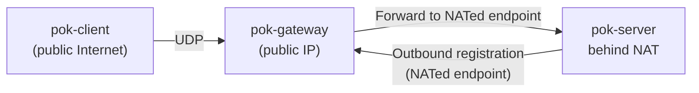

## Gateway forwarding model (formerly “forwarder”)

This document describes the gateway-based topology using the current project
terminology: **gateway** (older documentation used the word “forwarder”).

The idea is similar to a two-level gateway structure: the server establishes a
secure “backend” association to the gateway, and clients send packets to the
gateway which then forwards them to the right server.

See also:

- `docs/topologies.md` for a quick overview diagram
- `README.md` for DNS setup examples
- `protocol.md` for packet formats and phases

### Public-key based forwarding (serverID routing)

The gateway maintains a routing table keyed by **serverID**, where:

- **serverID**: server’s long-term public-key hash
- **value**: the currently registered server endpoint (IP:PORT observed by the
  gateway)

#### Backend registration (server → gateway)

The server registers by creating an authenticated/encrypted session to the
gateway. Conceptually:

- the server proves possession of its long-term key material
- the gateway learns the serverID and the observed IP:PORT of the server
- the gateway stores `serverID → serverEndpoint` until the server times out
  (keepalive is required)

### Client forwarding (client → gateway → server)

Clients always target a serverID. By default, `pok-client` sets:

- `extension = serverpkhash` (serverID)

Then the client sends packets to the gateway’s IP:PORT (often via DNS A records
pointing at the gateway). The gateway:

- extracts serverID from `extension`
- looks up the registered server endpoint for that serverID
- forwards the packet to that server endpoint

Conceptual data flow:

### NAT deployment scenarios

The gateway model is intended to work when the server is not directly reachable
from the client (for example because the server is behind NAT). The gateway
observes the server’s NATed endpoint during backend registration and forwards
client packets to that endpoint.

#### Scenario A: gateway with internal and external connectivity

One common deployment has the gateway reachable from both the server-side
network and the client-side network (for example, dual-homed host or routing
between subnets). The server registers from the internal side, clients connect
from the external side, and the gateway forwards between them.

#### Scenario B: gateway on the external Internet

If the gateway has only a public IP, the server behind NAT can still register
outbound to the gateway. The gateway then forwards client traffic to the NATed
server endpoint seen during registration.

### Peer-to-peer / hole punching (future direction)

Older documentation describes a possible extension where the gateway helps both
ends learn each other’s NATed endpoints and then the client and server switch to
direct communication (“hole punching”).

This repository’s documentation goal is to describe current behavior. If/when
peer-to-peer switching is implemented, this section should be updated to match
the code.

### Relationship to older documentation

This page is a rewrite of the older “forwarder” document using current naming.
Reference: [`forwarder.md`](https://raw.githubusercontent.com/janmojzis/pok/wip/forwarder.md).

