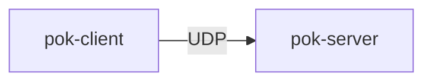
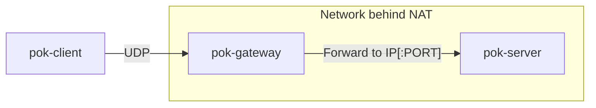
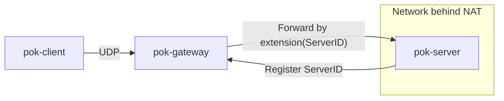

# INTRODUCTION
It is a tool that establishes an encrypted and authenticated connection between
a network client and a server. The connection is created using encrypted UDP
packets. Encryption is provided by algorithms that are resistant to attacks
using quantum computers XSalsa20, [Poly1305](https://lib1305.cr.yp.to),
[Classic McEliece mceliece6688128](https://lib.mceliece.org).

# Connection modes
The tool works in the classic `client-server` mode, but also aims
to be used in the `client-gateway-server` mode. Which can be used in cases
where the network structure is more complex (e.g. server behind NAT).

## Simple (direct) — client → server

`pok-client` creates direct connection to `pok-server`

## Advanced (forwarded) - client → gateway → server
  
`pok-gateway` is a UDP forwarding component that routes incoming packets from
`pok-client` to the appropriate backend `pok-server` based on metadata stored
in the packet’s extension field.

It:

- Inspects the extension field
- Makes routing decisions based on that field
- Forwards packets to backend servers
- Currently supports two modes:
  - IP[:PORT]-based routing
  - Public-key (ServerID)-based routing

---

### 1. Forwarding by IP[:PORT]

In this mode, the extension field directly contains the target backend address.

1. The gateway extracts `IP[:PORT]` from the extension.
2. It forwards the UDP packet to that address.
3. The backend server receives and decrypts the query packet.
4. The backend server encrypts and sends the response packet.
5. Gateway forwards the packet back to the client.

---

### 2. Forwarding by Server Public Key (ServerID)

In this mode, the extension contains a 32-byte public key identifying the backend server.

#### Backend Registration

- Each backend server establishes a persistent backend connection to the gateway.
- The backend authenticates using its public key (ServerID).
- The gateway associates that public key with the active backend connection.

#### Client Packet Handling

1. The client sends a packet.
2. The extension contains the 32-byte ServerID.
3. The gateway looks up the corresponding authenticated backend connection.
4. The packet is forwarded through that backend connection.

