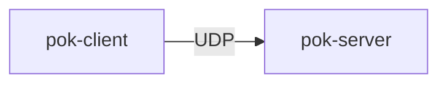
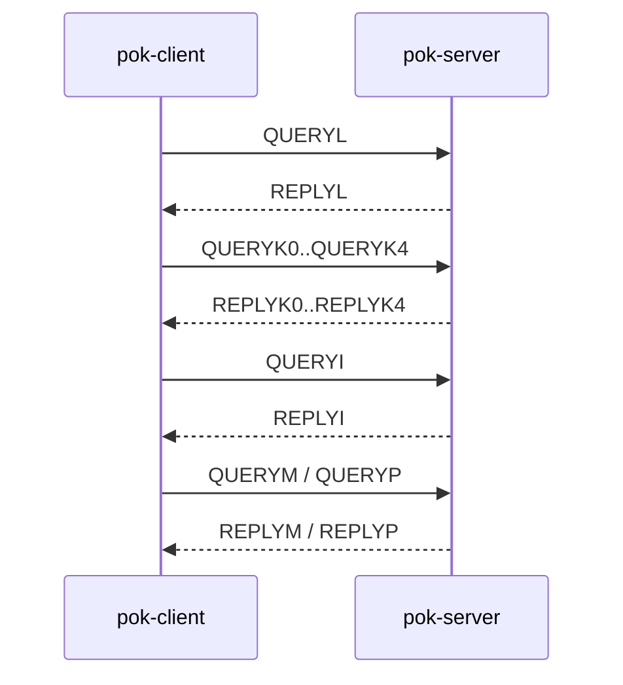
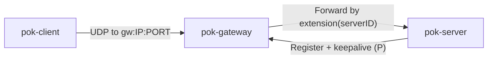
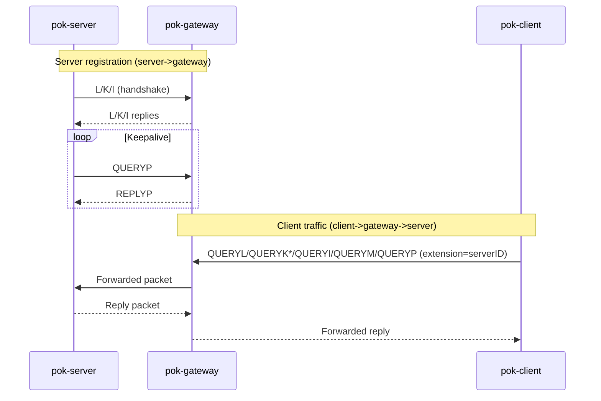

## Topologies

This project supports two deployment modes:

- **Direct**: `pok-client` → `pok-server`
- **Gateway**: `pok-client` → `pok-gateway` → `pok-server` (server registers to
  the gateway and is then reachable behind NAT)

All traffic is carried over UDP. The on-wire packet formats and phases are
documented in `protocol.md`.

### 1) Simple (direct) — client → server

Key phases (high level):

- **L**: download server long-term public key (Merkle tree)
- **K**: key exchange (one-time + authorization keys)
- **I**: initialization (derive session keys, start keyratchet)
- **M**: application message transport
- **P**: keepalive/ping (uses same keyratchet as M)

### 2) Advanced (gateway) — client → gateway → server

In gateway mode:

- the **server** registers to the gateway (handshake and then keepalive)
- the **client** sends packets to the gateway IP/port, but still targets a
  specific serverID
- the **gateway** forwards packets based on routing information in the
  32-byte `extension` field

#### Routing key: `extension` field

By default, `pok-client` sets `extension = serverpkhash` (serverID). This means
the client does not need to know whether it is talking directly to a server or
through a gateway.

When a gateway is used, DNS is typically configured so that:

- the server hostname `A` record points to the gateway IP
- the server hostname `TXT` record contains the **server** public-key hash
  (serverID)

See `README.md` ("Gateway forwarding mode") for the DNS setup examples.

#### Gateway registration vs forwarded client traffic

