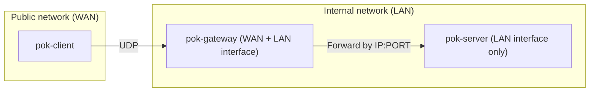

# IP:PORT based client-gateway-server example

## scenario



## run hello-world server
```
# create server keypair
./pok-makekey serverkeydir
pok-makekey: info: mceliece6688128 public-key created 'serverkeydir/public/c10e557e4dc562e9b6408951815b9c9cbfd03b84bec59cd157e5ef486ebe01d1'
pok-makekey: info: mceliece6688128 secret-key created 'serverkeydir/secret/c10e557e4dc562e9b6408951815b9c9cbfd03b84bec59cd157e5ef486ebe01d1'

# run server
./pok-server -vk serverkeydir 127.0.0.1 1235 sh -c 'echo ========== HELLO WORLD ==========' &
```

## run gateway
```
# run gateway
./pok-gateway -v 127.0.0.1 1234 &
```

## client connection
```
# run client (replace with YOUR KEYIDs)
# -R option: set the serverID explicitly
# -E option: insert server's 127.0.0.1:1235 into the extension
./pok-client -vk clientkeydir -R c10e557e4dc562e9b6408951815b9c9cbfd03b84bec59cd157e5ef486ebe01d1 -E 127.0.0.1:1235 127.0.0.1 1234 sh -c 'cat >&2'
```
