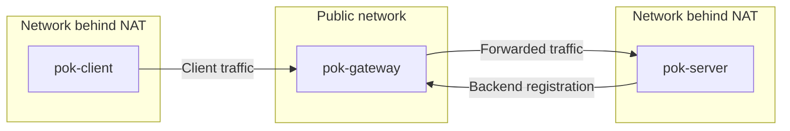

# Public-key based client-gateway-server example

## scenario



## run gateway
```
# create gateway keypair
./pok-makekey gatewaykeydir
pok-makekey: info: mceliece6688128 public-key created 'gatewaykeydir/public/438249e88a49f9d10d48513cdfa0f80efa3d752724da8600a873b53796af3721'
pok-makekey: info: mceliece6688128 secret-key created 'gatewaykeydir/secret/438249e88a49f9d10d48513cdfa0f80efa3d752724da8600a873b53796af3721'

# run gateway
./pok-gateway -vk gatewaykeydir 127.0.0.1 1234 &
```

## run hello-world server and connect to gateway
```
# create server keypair
./pok-makekey serverkeydir
pok-makekey: info: mceliece6688128 public-key created 'serverkeydir/public/c10e557e4dc562e9b6408951815b9c9cbfd03b84bec59cd157e5ef486ebe01d1'
pok-makekey: info: mceliece6688128 secret-key created 'serverkeydir/secret/c10e557e4dc562e9b6408951815b9c9cbfd03b84bec59cd157e5ef486ebe01d1'

# run server (replace with YOUR gatewayID)
# -G option: connect to gateway
# -R option: set the gatewayID explicitly
./pok-server -vk serverkeydir -G 127.0.0.1:1234 -R 438249e88a49f9d10d48513cdfa0f80efa3d752724da8600a873b53796af3721 127.0.0.1 1235 sh -c 'echo ========== HELLO WORLD ==========' &
```


## client connection
```
# run client (replace with YOUR KEYID)
# -R option: set the serverID explicitly
./pok-client -vk clientkeydir -R c10e557e4dc562e9b6408951815b9c9cbfd03b84bec59cd157e5ef486ebe01d1 127.0.0.1 1234 sh -c 'cat >&2'
```
