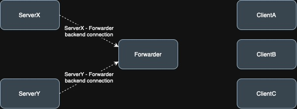
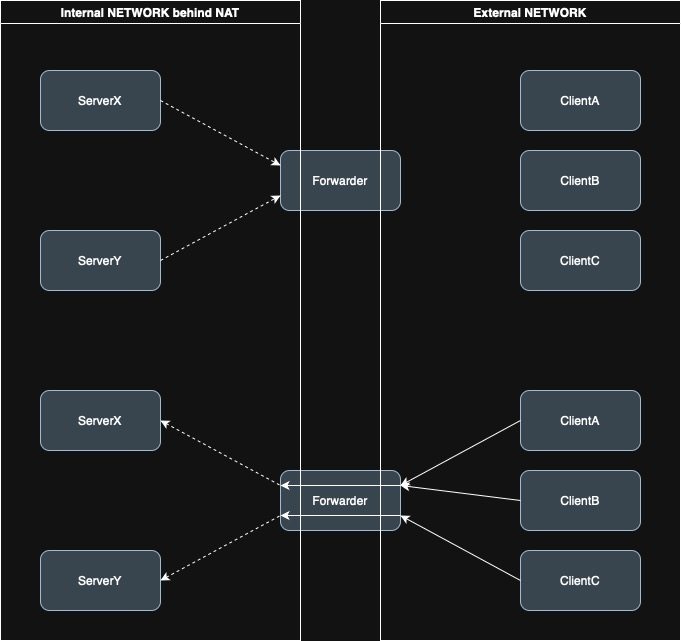
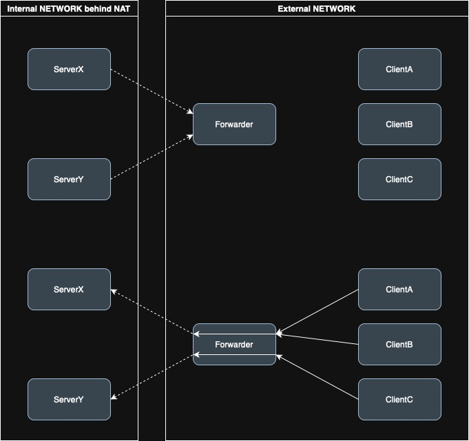
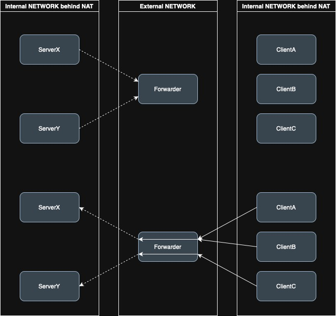
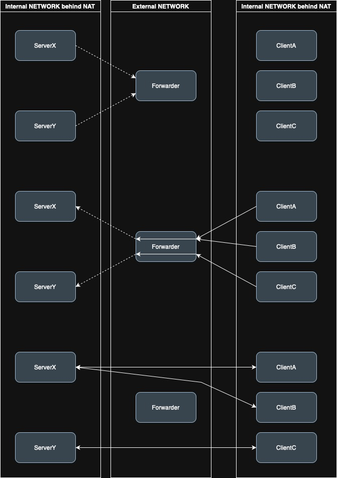

# client - forwarder - server connection
In this case, the `forwarder` forwards packets between the client and the server
and helps create connections in more complicated networks, e.g. when the server
is behind NAT.
This idea is taken from [CurveCP Two-level gateway-server structure](https://curvecp.org/addressing.html).

## public-key based forwarding
The server creates an encrypted/authenticated "backend" connection to
the forwarder. The server authenticates using its long-term key.

And when a backend connection is established, then the forwarder knows:
  - server's long-term public-key hash
  - IP/PORT from which the server established the connection (backend connection)

The forwarder will perform these steps based on server's public-key/IP/PORT:
  - first, forwarder checks whether the forwarding service is enabled for
    the server with this public-key
  - second, if the server is allowed, the forwarder will update its forwarding
    table (server public-key hash -> server IP:PORT) and can start forwarding
    traffic from the clients to the server with given public-key.

Client packets are now forwarded as follows:

The client adds the server's public-key hash to the "extension" field in
the packet and sends the packet to the forwarder's IP:PORT. The forwarder
extracts the public key hash from the "extension" field.
It searches its forwarding table and if it finds the public-key, it forwards
the packet to the server's IP:PORT with given public-key hash.

# Examples

## server behind NAT, forwarder has internal and external IP

## server behind NAT, forwarder has only external IP

## server behind NAT, forwarder has only external IP, client also behind NAT

## server behind NAT, forwarder has only external IP, client also behind NAT, peer-peer connection

