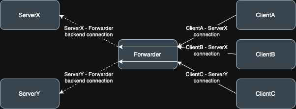

# client - forwarder - server connection
In this case, the `forwarder` forwards packets between the client and the server
and helps create connections in more complicated networks, e.g. when the server
is behind NAT.
This idea is taken from [CurveCP Two-level gateway-server structure](https://curvecp.org/addressing.html).

## public-key based forwarding
The server creates an encrypted/authenticated "backend" connection to
the forwarder. The server authenticates using its long-term key.

And when a backend connection is established, then the forwarder knows:
  - server's long-term public-key hash
  - IP/PORT from which the server established the connection (backend connection)

The forwarder will perform these steps based on server's public-key/IP/PORT:
  - first, forwarder checks whether the forwarding service is enabled for
    the server with this public-key
  - second, if the server is allowed, the forwarder will update its forwarding
    table (server public-key hash -> server IP:PORT) and can start forwarding
    traffic from the clients to the server with given public-key.

