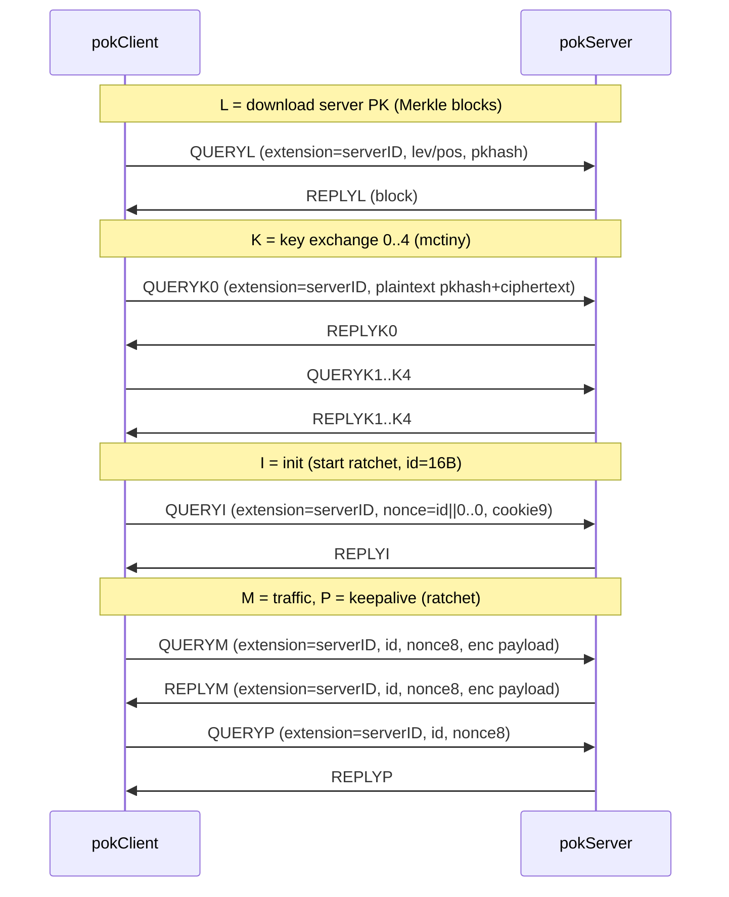
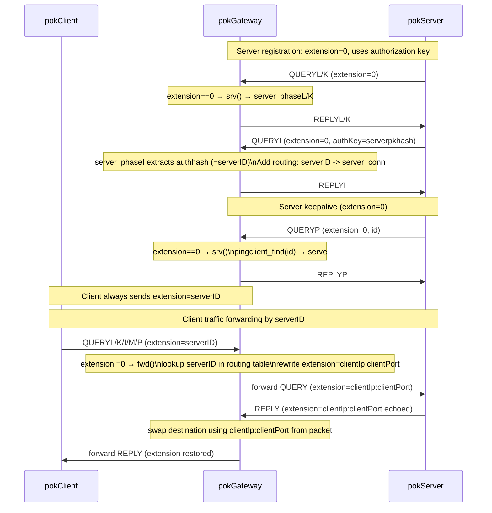

# Packet flow diagrams

This file documents the high-level packet flow for:
- direct `client-server`
- relayed `client-gateway-server` (forwarder)

## Legend
- **Phases**: `L` (download PK), `K` (KEX 0..4), `I` (init), `M` (traffic), `P` (keepalive)
- **serverID**: 32B identifier carried in `extension` (recommended: `serverpkhash`, i.e., Merkle root / DNS `PoKv0dD=` value)
- In `client-gateway-server`, the gateway uses `serverID` to select the registered server, and may temporarily overwrite `extension` on forwarded packets for reply routing.

## Direct: client-server

## Relayed: client-gateway-server (forwarder)

### Gateway dispatch: extension-based routing

Gateway uses simple stateless dispatch based on `extension`:

1. **`extension == 0` (32B zeros)** → Gateway connection (srv)
   - Serves K/L/I/P packets as server
   - After I: extracts `authhash` (authorization PK hash) = `serverID`
   - Creates routing entry: `serverID → server_conn`

2. **`extension == serverID` (32B hash)** → Forward mode (fwd)
   - Lookup `pingclient_findpk(serverID)` → find registered server
   - Forward packet with rewritten `extension=clientIp:clientPort`

3. **`extension == IP:PORT + zeros`** → IP forwarder mode (ipfwd)
   - Legacy mode for direct IP routing

**Key cryptographic property**: Server proves ownership of `serverID` by using its authorization private key during handshake. Gateway verifies this in `server_phaseI`, ensuring only legitimate servers can register under a given `serverID`.

